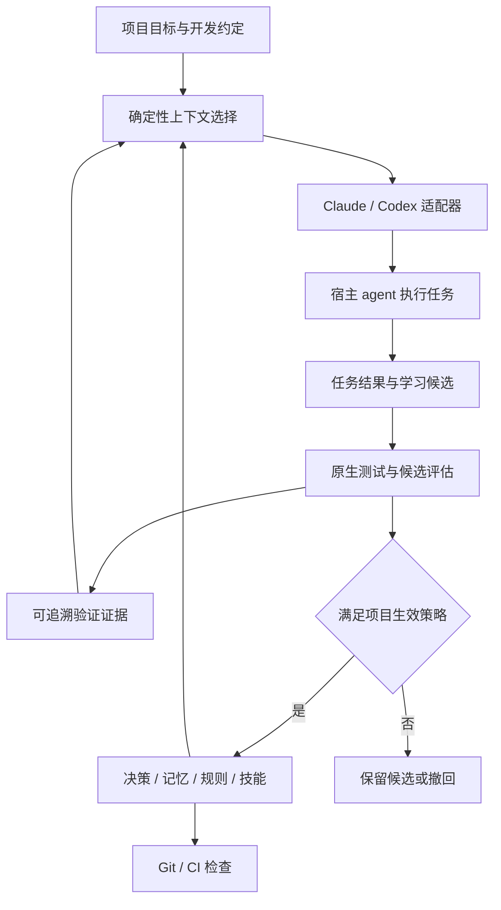

# keel 架构审查与修订建议

日期：2026-09-10。范围：[README](../../README.md)、[设计文档](./design.md)、[格式与命令规格](./formats.md)。当前仓库没有实现和提交历史；下文区分文档缺陷、协议核实与建议设计，不声称已经验证产品运行效果。

**回写状态（同日）：** P1/P2 建议已写入 `design.md`、`formats.md`、`README.md`。两个已复现的 shell 缺陷锁定在 [fixtures/](./fixtures/)。本文保留为审查原文；实现以回写后的 design/formats 为准。

## 1. 审查结论

保留「仓库即大脑、确定性 Go 内核、智能交给宿主 agent」三条边界。它们足以支撑有用的统一开发底座，无须引入服务、向量库、模型网关或完整 agent runtime。

当前设计可以作为原型起点，但还不能以「自动进化、越来越可信的自主开发」为验收承诺。关键缺口是：**没有把任务结果、证据有效性、知识适用范围和行为变化连接起来**。增加笔记、规则和 proven 数量，无法证明下次任务做得更好。

建议把产品目标改写为：

> keel 把项目目标、开发约定、任务经验和验证证据保存在仓库中，为不同 coding agent 提供一致、相关、可追溯的工作上下文，并通过可验证、可撤回的规则与技能更新，减少重复犯错和重复探索。

自主开发的收益先来自减少不必要的询问、准确复用先例与可靠验证；扩大自决范围是有证据后的结果。

## 2. 按优先级排序的发现

### P1-01：Git hook 示例会吞掉所有检查失败

位置：`formats.md:340`、`formats.md:348`，与 `formats.md:352` 的阻断承诺直接矛盾。

`command -v keel ... && keel check ... || true` 在 keel 已安装但检查失败时仍返回 0。两道提交检查都失效。已用 shell 函数模拟失败的 keel：原脚本返回 0，显式传播失败的脚本返回 1。

示意修正如下；实际参数在提交目标协议确定后实现：

```sh
if command -v keel >/dev/null 2>&1; then
  keel check --quiet || exit "$?"
fi
```

安装时还不能简单在任意既有 hook 末尾追加 shell：既有脚本可能提前 `exit`，也可能使用 Python 等解释器。必须识别 `core.hooksPath`、worktree 和现有 hook 管理器，使用明确的调用链；不支持的组合报告具体集成缺口。Git 官方说明了 hook 路径、可执行位和非零退出码的要求。[Git hooks](https://git-scm.com/docs/githooks)

验收：检查失败、未安装 keel、已有 hook 失败、非 shell hook、自定义 hooksPath、worktree 六种情况都有明确结果。

### P1-02：业务 CLI 的退出码与宿主 hook 协议混用

位置：`design.md:136` 的退出码约定；`formats.md:231`、`formats.md:298`、`formats.md:311`。

普通 CLI 以 1 表示检查失败、2 表示用法错误，不能原样映射为所有宿主的生命周期行为。Codex 的 Stop 文档规定以 exit 0 的 JSON 返回继续执行决定，或以 exit 2 加 stderr 表示继续；而当前模板直接执行普通 `check --gate --json`。CLI 的用法错误也可能被误解释成继续执行请求。[Codex Hooks](https://learn.chatgpt.com/docs/hooks)

Claude 当前文档允许有效 JSON 在部分非零退出码上仍生效，因此不能笼统断言「exit 1 一定不拦」。适配必须明确输出 schema 与版本，采用 exit 0 + 合法 JSON 作为正常决策路径。[Claude Hooks](https://code.claude.com/docs/en/hooks)

新增内部入口 `keel hook <adapter> <event>`：读取 stdin 事件，调用共享内核，再编码成宿主输出。`check --json` 返回 keel 自己的稳定结果，不返回 Claude/Codex 专属的 `decision` 对象。

另一个确定的遗漏：Codex 项目层受信任以后，非托管 hook 的具体定义仍需通过原生信任流程。新建或修改 hook 会影响信任状态；「信任项目一次」不足以描述安装完成条件。适配器必须报告未就绪状态，不能自动绕开原生信任。[Codex hook trust](https://learn.chatgpt.com/docs/hooks#review-and-trust-hooks)

### P1-03：gate 没有绑定准确变更，无法证明提交已留痕

位置：`formats.md:222`、`formats.md:226`、`formats.md:237`；`design.md:170`、`design.md:176`。

当前条件允许新增任意 decision 文件就满足新依赖信号，没有要求状态、scope 或内容与变更匹配。`decide` 默认又允许空正文。因此「新增依赖 + 新建不相关空 ADR」即可通过设计中的门禁。

同时存在三个缺口：

- Stop 时不一定有待提交消息；Git 没有规格所称的「暂存的 commit message」。可能读到旧提交的消息文件。
- 以 HEAD 与工作树比较，会混入会话开始前的脏文件，并漏掉当前任务已经提交的变更。pre-commit 从工作树运行检查，则可能用尚未暂存的修复替已暂存的坏代码通过验证。
- 同一信号第二次直接放行，把防止无限继续执行变成了检查豁免。即使修好 Git hook，普通 `check` 也没有重新执行依赖留痕要求；没有 Stop hook 的路径仍缺少兜底。

修订为明确的工作树、index、commit/range 三种检查目标。Stop 只提供有界纠正机会；Git/CI 对实际提交重新计算必需检查。去重只抑制重复反馈，不能把 failed 改成 passed。详细协议见 §5。

### P1-04：agent 可以用自己写的 proven 状态扩大自决范围

位置：`design.md:191`、`design.md:203`、`design.md:210`、`design.md:217`；`formats.md:366`、`formats.md:370`。

agent 既写决策，又判断证据并改成 proven，随后同 tag 三条记录就提高级别。没有独立验证约束时，这是自我确认循环。三个 SQLite 使用先例不能覆盖同为 `db` 的生产迁移、数据删除或备份策略。

「没有 revert、规则全绿、出现 churn」只能说明尚未观察到某些失败。规则可能未执行、没有测到相关行为，revert 文案可能被改写。自评 confidence 和 `by: human` 字符串也不是证据或身份校验。

多 tag 的合并规则没有定义；技能摘要更把 `>= 1` 都当成可直接 decide，漏掉级别 1 的先例条件。省略 security tag 就可能绕过原本的谨慎策略。

建议：tag 只服务检索；自决范围由动作类别、路径、风险与既有授权共同界定。MVP 停用按计数自动升级，只输出建议；后续允许在已设定上限内，凭有效证据自动调整。keel 的 workflow policy 不得声称能授予宿主沙箱、网络或发布权限。

### P1-05：记忆没有证据生命周期，晋升后会把错误反复放大

位置：`formats.md:133`、`formats.md:259`、`formats.md:368`；`design.md:183`、`design.md:191`。

笔记只有类型、tag、路径、日期和作者。无法区分「猜测」「复现过的事实」「特定版本下的结论」「已被反例推翻的经验」，也没有来源、验证版本、失败证据或替代关系。相同 tag 的三条不同事实并不构成同一个可泛化规律；同一错误的三次转述也不是三份独立证据。

规则连续失败、被拦次数又依赖未定义的历史存储。若只存在 gitignore 的 cache 中，换机器后候选和自主度就不同，违背可随 clone 迁移的核心目标。

将「观察 -> 候选知识 -> 验证 -> 生效 -> 失效/撤回」作为统一生命周期。决策、规则、技能是不同用途的产物，不要求逐级转换。一条可靠事实可以长期只是事实；一次架构选择不一定产生技能。最小证据模型见 §4。

### P1-06：状态转换会提前撤销决策，历史查询会丢掉反例

位置：`formats.md:109`、`formats.md:178`、`formats.md:184`；`formats.md:129`。

`decide --status proposed --supersedes D0004` 按现规格立即把旧决策置为 superseded，即使新决策尚未接受。另一个冲突是：只有 active 决策参与 why，因而找不到已否决方案的理由；删除 stale 条目进一步丢失长期记忆。

新提案只记录替代意图；在 accepted 转换时原子更新两端引用。默认 brief 只选有效结论，`why` 保留 rejected/superseded 历史并明确标记，支持按提交回溯。路径变化先重定位或标 stale，归档保留原因；不自动删除决策与反例。

派生规则也需要独立状态。依据失效不代表应继续强制执行，也不代表可以自动取消约束；替代决策必须同时说明规则迁移。否则 agent 会同时读到新决策与旧硬规则。

### P1-07：自动学习内容可以直接变成可执行规则

位置：`formats.md:119`、`formats.md:126`、`formats.md:159`、`formats.md:249`、`formats.md:370`。

rule 中的 shell 会在 check 执行；brief 的缓存过期也会触发 check。来自模板或自动提炼的内容因此可能在会话启动时立即变成代码执行。原生 hook 信任通常覆盖 hook 定义，不能据此推导被它间接调用的每条新规则也都已获信任。

这不是增加一套重型权限系统的理由。最小修订是明确：读取/检索不执行规则；新增可执行规则默认为 candidate；执行策略来自已有的项目授权；候选不得通过修改自己的验证器使自己生效。规则有效性检查和项目原生测试在明确的 check 阶段执行。

`sh -c` 不等于沙箱。执行器应限定 cwd、超时和子进程清理，区分 pass/fail/error/timeout/skipped；规则用到的语言工具仍是外部依赖，应把「无运行时依赖」限定为 keel 二进制本身。

文档中的 `! grep ...` 还有一个已复现缺陷：目录不存在时 grep 返回错误，`!` 将其变成成功。示例应优先调用已有检查工具，或显式区分 grep 的无匹配与执行错误。

### P1-08：sync 的所有权不足以实现无损、幂等合并

位置：`design.md:150`；`formats.md:304`、`formats.md:329`、`formats.md:332`、`formats.md:356`。

以 `command` 的 keel 前缀识别 hook，不能区分用户手写调用与生成条目。只声明「拥有 MCP 表」也不能处理同名用户 server。技能上的空标记只能证明曾被管理，不能发现之后的人工修改。删除源技能、同名冲突、中途失败和回滚均缺少协议。

同时，Codex 示例把 `${GITEA_TOKEN}` 放入 `env`，假设它与 Claude 的变量展开一致。官方 Codex 文档分别定义静态 `env` 与转发变量的 `env_vars`；应输出 `env_vars = ["GITEA_TOKEN"]`。需要变量重命名时显式报告支持情况。[Codex MCP](https://learn.chatgpt.com/docs/extend/mcp?surface=cli)；[Claude MCP 变量展开](https://code.claude.com/docs/en/mcp#environment-variable-expansion-in-mcp-json)

修订：维护可提交的生成清单，记录文件/字段所有权、生成摘要和适配器 schema 版本；先完整规划 diff 和冲突，再写入。同名非托管内容报冲突；被人改过的托管内容也报冲突。删除源对象仅清理仍与上次生成值相同的产物。机器探测与渲染分离，避免同一源在不同机器得到无意差异。

### P1-09：单调 ID 加事后重编号会破坏并行开发中的历史引用

位置：`formats.md:21`；`design.md:275`。

两个 worktree/分支都生成 D0013 后，修改一侧文件名和当前引用无法修复已经写入旧提交的 `Decision: D0013`。合并以后相同历史标识代表两个不同决定，`why` 可能把提交关联到错误决策。同 worktree 并发写还可能在检查前覆盖文件。

建议从 v0.1 使用带类型前缀的随机唯一标识，例如 UUID；时间和标题负责展示排序，短前缀仅作无歧义的人类输入。canonical ID 永不重编号，trailer 使用完整标识。用独占创建、同目录临时文件与原子替换保护写入；多文件状态转换还需锁和恢复记录。这不需要分布式服务。

### P2-10：brief 按时间选材料，缺少任务意图和上下文预算

位置：`formats.md:245`、`formats.md:248`、`formats.md:249`；`formats.md:271`。

「最近 14 天改过什么」不能代表本次要做什么。只注入决策标题也不足以恢复决定的理由和适用边界；120 行无法限制超长正文。改文件前才要求先知道某个 scope，也形成发现入口上的循环。

另外，AGENTS/CLAUDE 静态块内的自主度在 note/decide/review 之后可能过期。检查缓存只按一小时失效，无法区分另一个分支、另一个工作树或刚修改过的规则。

增加 task/path 查询入口，按相关性与有效性确定材料，预算约束内容总量，并输出每条被选中的原因。静态文件只承载稳定协议与入口；动态状态从 brief 查询。缓存按代码目标、规则集、策略、工具版本绑定，缺失或不匹配就显示 unknown，不能用旧绿色代替验证。详见 §6。

### P2-11：现有里程碑验证配置生成，没有验证「更聪明」

位置：`design.md:264`、`design.md:265`、`design.md:266`。

出现标记块、Stop 被拦、构造三条 proven 后升级，都不能证明 agent 找到正确记忆、减少重犯或能从 Claude 切换到 Codex 接着工作。M3 甚至把最需要质疑的计数策略本身当成验收。

把跨工具任务接续、旧教训的有效召回、错误记忆的撤回、规则误报和技能更新前后对照列为验收。先用小型固定任务集；不增加 Dashboard，不以记录条数或 token 降低代替任务质量。详见 §8。

### P2-12：实现前需统一的规格冲突

| 位置 | 缺口 | 建议 |
|---|---|---|
| `design.md:107`、`design.md:225` | `find` 不在八个命令中 | 统一到 `why --query`，不增加重复入口 |
| `design.md:137` 与 note 规格 | 宣称 note 支持 `--body -`，语法未定义 | 补充 stdin/file 正文契约 |
| `design.md:275` 与 decide 规格 | `--renumber` 未定义 | 采用稳定 ID 后删除该承诺 |
| `formats.md:21` 与 R003 示例 | 四位 ID 规则与三位示例冲突 | 一次性统一 canonical ID 格式 |
| `design.md:164`、`formats.md:228` | scope 命中是否阻断不一致 | 命中用于上下文；语义变化才要求解释 |
| `formats.md:273`、`formats.md:366` | 级别 1 的先例条件不一致 | 所有入口使用同一策略计算结果 |
| `formats.md:23` | 未知字段静默保留会掩盖策略拼写错误 | 核心字段严格校验；扩展使用 `extensions` 命名空间 |
| `formats.md:159` | 导入 rules 却不导入被 from 引用的 decisions | 模板规则保留模板来源；未映射的项目决策引用不能生效 |
| `design.md:16` 与 `init --from`、self-update | 绝对无网络与下载能力矛盾 | 核心运行离线；显式安装/更新才访问网络 |
| `formats.md:200` | 不存在的路径当关键词 | 显式 `--path` 支持新文件、删除和重命名历史 |

## 3. 建议的架构边界

统一底座应共享四种语义：**项目意图、上下文材料、验证证据、工作流策略**。工具目录是对这些语义的投影；各工具的 hook、权限和发现规则保留原生差异。



keel 内核仍只做解析、查询、差异计算、命令执行和结果验证。agent 负责理解需求、解释反例、整理经验和编写技能。自然语言判断不能被包装成「计数是确定性的，所以结论客观」。

推荐在既有包结构内增加 `policy` 与 `evidence`，让 adapter 只负责能力探测、产物渲染和事件编解码。不要把业务策略散落在两套 skill/hook 模板中。

## 4. 最小可用的累积记忆

### 4.1 在原目录上增补

```text
.keel/
  intent.md                 项目目标、非目标、约束、完成标准；可引用现有文档
  keel.yaml                 工具与工作流策略
  decisions/                选择及其理由，保留否决与替代历史
  memory/                   有来源和适用条件的事实、经验、反例
  rules/                    不变量，区分 candidate / active / retired
  skills/                   可复用流程；保留来源、版本与评估信息
  evidence/                 值得跨会话保留的验证摘要，Markdown + YAML
  knowledge/INDEX.md        派生索引
  generated.yaml            产物所有权与 schema 版本
  cache/                    可删的运行缓存、原始日志、临时任务接续信息
```

`intent.md` 应优先引用已有 README、产品要求和架构目标；keel 不猜测目标。无额外输入也能初始化，其未明确部分标记为待补充，不阻塞一般开发。

任务接续与长期记忆分开：同机 Claude/Codex 共享 worktree 对应的缓存接续摘要，至少包含当前目标、完成项、下一步、失败验证和引用。跨 clone 只保证已提交的知识与证据；需要跨机器接续时显式把经过整理的摘要保存为 memory。缓存被删除不会撤销已生效知识，也不会丢失其验证依据。

### 4.2 记忆与证据字段

以下为建议 schema 的字段片段，非当前 CLI 已支持的格式：

```yaml
# memory frontmatter
schema: 1
id: M-<uuid>
kind: gotcha
status: candidate                 # candidate | verified | disputed | stale | archived
summary: 某项操作在给定环境下失败，替代方法通过了复现用例
tags: [storage]
scope: ["internal/store/**"]
conditions:
  environment: 描述已测试的环境与适用边界
evidence: [E-<uuid>]
derived_from: []
supersedes: []
verified_at: 2026-09-10
review_after: 2026-12-10
```

```yaml
# evidence record
schema: 1
id: E-<uuid>
subject: M-<uuid>
subject_digest: sha256:<digest>
kind: regression-test
target:
  commit: <tested-commit>
  content_digest: sha256:<tested-content-digest>
verifier:
  id: store-regression
  definition_digest: sha256:<digest>
  command: [go, test, ./internal/store/..., -run, TestRegression]
result: pass                       # pass | fail | error | timeout | skipped
observed_at: 2026-09-10T12:00:00Z
producer: keel-check               # 来源声明，不等于身份认证
```

证据保留被验证版本、验证器版本、结果和可复现入口；只需提交提炼后的有效摘要，不把每次工具调用或完整对话放进 git。执行输出默认留本地，引用和摘要避免包含密钥与不必要的个人信息。

content digest 用明确定义的输入集合计算，排除证据文件自身和 cache，避免证据写入导致自身失效。dirty 工作树证据必须能说明具体输入，不能仅凭 HEAD 绑定。只提供 commit 的记录要求目标确为该提交的内容。

hash 只能发现内容变化，不能证明执行者可信。agent 手填的 pass 是声明；可复现执行或项目既有审查流程才提供相应验证。项目无可信 CI 时明确展示 local/self-reported 状态，不伪装成跨机器认证。

### 4.3 可信度按条件处理，不用单个分数包办

- 未验证记录可检索，但标 candidate；不以命令式口吻注入为项目规则。
- verified 必须有相关证据；代码、工具或适用条件变化后允许转 stale，而非永远可信。
- 矛盾记录标 disputed，召回时同时展示冲突和来源。不能按最后修改时间静默覆盖。
- 失效、否决与失败是长期记忆的一部分。归档降低召回优先级，不删除历史解释。
- `confidence` 可作为作者判断保留，但不能单独授予可信状态或自决能力。

## 5. 验证与门禁协议

### 5.1 按被验证对象划分

| 调用场景 | 目标 | 行为 |
|---|---|---|
| SessionStart / brief | 当前仓库与查询范围 | 只读上下文和有版本依据的状态，不运行项目检查 |
| Stop | 明确的任务基线与当前工作树；未知基线则标明范围不确定 | 提供纠正建议，记录 unresolved；不读取猜测的消息草稿 |
| pre-commit | index 快照 | 验证实际将提交的文件和相同快照中的规则、决策 |
| commit-msg | `$1` 消息文件 + index | 解析真实 trailer，并验证是否覆盖需要解释的语义变更 |
| CI | 显式 base/head 与固定的验证策略 | 重算验证、决策覆盖与生成产物漂移 |

index 检查可在临时快照中执行；不能偷偷 stash/reset 用户工作树。若 MVP 不支持可靠的暂存快照，就对相关部分暂存情形报告无法完成提交验证，并给出解决步骤。不能把工作树通过伪装成 index 通过。

会话基线保存 HEAD 和初始脏文件指纹。新会话默认不声称拥有此前所有改动；恢复会话保留已识别基线。跨多个会话的任务由明确 base 或接续摘要关联。Stop 的归属判断仅辅助提醒，提交检查不依赖这种推断。

### 5.2 用结构化差异识别架构信号

对已支持 manifest 解析依赖集合、类型和来源的变化，区分格式调整、版本更新和新依赖。嵌套 manifest、首次提交、文件删除也有测试。未知格式只报告待判断信号，不谎称能证明新增依赖；严格项目可配置显式说明要求。

`.keel/` 与生成工具目录等脚手架产物不应因 init 本身触发「新架构目录」。公开接口、跨模块设计等语义不能靠目录 diff 完全检测，继续由技能识别并说明机械检查的覆盖边界。

决策引用至少满足：对象完整且处于可用状态、覆盖相关路径、并与本次依赖或契约变化建立解释关系。明确复用已有先例时可以引用已有决策，不强迫每次都创建新 ADR；无关 ID 和空文件不算覆盖。

trailer 通过 `git interpret-trailers --parse` 解析，避免把正文里的相似字符串当作引用。squash merge 的 CI 检查还应覆盖完整 PR 变更，而非仅依赖中间提交 trailer 被保留。[Git trailer parser](https://git-scm.com/docs/git-interpret-trailers)

### 5.3 分离「继续工作」与「检查通过」

内核返回 `status + findings + target + evidence`。普通 CLI、Git hook 与宿主 hook 分别解释这些结果。所有机器输出携带 schema 版本，stdout 只放机器结果，诊断写 stderr；finding 使用稳定 code、对象/路径和可执行的修正建议，不要求 agent 解析中文自然语言判断成功与否。

Stop 首次出现可修正问题时可请求一次继续；已有 `stop_hook_active` 或已反馈相同问题时结束循环，并明确保留未解决结果。不会产生成功证据，也不会令提交检查豁免。支持 turn id 时以 repo/worktree/session/turn/信号摘要去重；不支持时用宿主循环字段与输入摘要，不能用 session id 永久放行后续任务。

用户明确中止或任务只要求分析时，不用「必须写代码/提交/产生笔记」的循环强迫继续。没有值得学习的内容时允许零记录结束。

本地 Git hook 可被跳过，也不会随普通文件提交自动安装到每个 clone。需要合并门禁的项目复用现有 CI；无 CI 时产品只承诺本地协作约束。[Git hooks](https://git-scm.com/docs/githooks)

## 6. 上下文编译与工具适配

### 6.1 上下文有稳定入口，也有按需正文

| 层次 | 内容 | 装载方式 |
|---|---|---|
| 稳定协议 | 项目目标入口、验证命令、知识查询方法、工作流上限 | CLAUDE.md / AGENTS.md 托管块 |
| 任务上下文 | 当前目标、相关约束、关键先例、近期失败、接续摘要 | brief 按任务与路径选择 |
| 细节 | 决策理由、反例、完整技能和证据 | why 输出来源后按需读取 |

建议给 brief 增加 `--task`、`--path` 和明确的字节预算，给 why 增加 `--path`、`--query`、`--history`。SessionStart 尚无任务目标时只提供基础材料；agent 理解用户请求后主动查询。可选的任务提交/压缩恢复事件用于增强体验，不新增每次工具调用监听。

最初按确定性顺序排序：显式 ID/路径命中、适用条件、冲突与失败提醒、有效证据、主题匹配、时间；同分按稳定 ID 排序。检索结果包含 `why_selected`、状态、来源路径与版本。候选事实和外部材料作为引用呈现，不提升成执行指令。

正文用 UTF-8 字节上限硬约束，可额外显示 token 估算，不能宣称跨模型精确 token 数。关键约束优先保留，超预算材料显示省略摘要和原文位置，不能静默丢掉。无需在 v0.1 引入向量库；召回评估不足时再考虑本地全文排序。

Codex 有原生 AGENTS.md 层级覆盖及默认体积限制；它的技能发现也与当前工作目录相关。适配不能保证相同文件文本就产生完全相同的有效上下文。[Codex AGENTS.md](https://learn.chatgpt.com/docs/agent-configuration/agents-md)；[Codex skills](https://learn.chatgpt.com/docs/build-skills)

### 6.2 适配能力要有状态

每个 adapter 声明可验证的能力：instruction、skill、MCP stdio/HTTP、启动上下文、Stop 继续、压缩恢复。分别报告 supported/unsupported/unknown 和就绪条件。

`sync` 按源配置与固定 adapter schema 生成；诊断入口负责发现安装版本和本机状态。没有可确认的原生信任状态时报告 unknown 并指向原生检查入口，不以「文件存在」认定已启用。

能力缺失时仍可使用稳定协议、skills、显式 CLI 与 Git/CI。降级应说明失去哪些自动触发能力。实际宿主版本要用捕获的事件夹具和端到端 smoke test 验证；本次官方文档核查不等于支持了所有桌面端、IDE、CLI 与云端版本。

## 7. 自动进化的具体闭环

自动进化必须同时回答：由谁触发、拿什么证据、改什么、怎样验证、何时生效、失败怎么撤回。

1. **记录结果。** 宿主 agent 在任务结束时整理值得保留的经验；keel 保存相关验证摘要。现有 `keel-learn` 可以承担，不要求存完整会话。
2. **找候选。** review 按重复问题、相关失败、显式纠正、过期依赖给出候选与依据。次数只决定审阅优先级，不直接决定可信或生效。
3. **生成修订。** `keel-review` 为事实、规则或技能生成 candidate，附来源、适用条件、反例和预期收益。每个维护批次限制候选数，避免任务收尾无限扩展。
4. **对照验证。** 硬规则测试一个应该通过、一个应该失败及一个边界用例；技能在固定任务和固定项目快照上比较旧版与候选。验证器由现行基线提供，不能同一候选自行放宽后宣告通过。
5. **按已有策略生效。** 在预授权范围内，补充来源、去重和通过验证的事实可自动维护。新硬规则、改变项目约束或扩大工作流上限的修订经过项目既有审查路径；不要求每条普通笔记都询问用户。
6. **回看与撤回。** 记录生效版本、证据和被替代版本。发现反例或回归就标 disputed/retired，恢复相应旧规则或技能；不撤销不相关的业务代码，不删除失败历史。

执行时机：learn 跟随有价值的任务结果；review 在显式维护任务或有界的收尾维护中运行。没有活动中的宿主 agent 时不自行调用模型；未来可由用户已有自动化启动宿主完成维护，不在 keel 内引入模型调用或常驻服务。

技能评估需要宿主执行任务，模型成本发生在 Claude/Codex 一侧；keel 仅组织夹具、校验结果、归档证据。自动编写技能本身不算完成一次进化。

### 工作流自主度的修订

MVP 保留 0/1/2 作为工作流建议，但其上限由项目既定策略给出；显式用户授权持续有效，不因一条笔记或低级别提示重复请求。级别 1 只允许复用适用范围内、没有失效证据的先例。

后续允许的计算形态是：

```text
项目内可自决范围 = 已有授权与项目策略上限
                 ∩ 当前动作和路径范围
                 ∩ 有效先例及验证条件

有效执行还必须满足宿主和组织的原生权限要求。
```

多项策略同时命中取约束更严格者；低风险标签不能抵消路径或动作上的限制。解析不了风险时不推导自动升级。新增 proven 只影响建议和先例可用性，不能单靠计数扩大上限。修改这套策略走原有配置审查，不由正在争取升级的候选自我批准。

## 8. 修订后的里程碑与验收

| 阶段 | 交付 | 验收重点 |
|---|---|---|
| M0：协议定稿 | 稳定 ID、状态机、检查目标、hook 结果、生成所有权、最小证据 schema | 本文 P1 问题都有一致契约与对应夹具 |
| M1：统一底座 | init/sync/decide/why/check，加最小 brief/note、两套适配、Git/CI 接入 | Claude 写出的经验由 Codex 正确召回；提交坏代码会失败；重复 sync 无差异 |
| M2：可信记忆 | 任务接续、证据记录、冲突/过期/归档、任务相关检索 | 换工具继续同一任务；旧结论失效后不被当成现行规则；clone 保留验证依据 |
| M3：受控进化 | review 候选、技能/规则版本、任务对照评估、生效与撤回 | 学习后正确完成复发任务；无关任务不被新规则误伤；失败候选不生效 |
| M4：复用与扩展 | 固定来源版本的模板导入、更新差异与更多适配器 | 模板更新不覆盖本地演化；未支持能力被准确报告 |

建议首批验收场景：

| 场景 | 必须观察到的结果 |
|---|---|
| 只有三个手写 proven、没有验证证据 | 自决上限不变，指出缺失依据 |
| `db` 成功先例 + 高风险数据操作 | 不因同 tag 自动复用授权 |
| 新增依赖 + 无关/空 ADR | 提交验证失败，说明具体未覆盖信号 |
| 更新 manifest 格式或普通脚本 | 不误报为新增依赖 |
| 不受信任的 Codex hook | 诊断明确显示未启用，显式 CLI 仍可用 |
| Stop 反复出现同一个未解决问题 | 结束重复反馈，保留失败状态；提交依旧检查 |
| 暂存坏代码、工作树有未暂存修复 | 不以工作树结果证明 index 通过 |
| proposed 决策声明替代 accepted 决策 | 旧决策继续生效，直到合法状态转换 |
| 两个 worktree 同时记忆和决策 | 无 ID 混淆或覆盖，历史 trailer 仍可解析 |
| 用户改过生成技能；源技能随后被删除 | sync 报冲突，不覆盖或删掉用户修改 |
| 切换分支、修改规则后立即 brief | 旧验证不显示为当前通过 |
| 错误笔记被重复引用三次 | 不算三份独立证据，不自动升级成规则 |
| 已否决方案在新任务中再次被考虑 | why 能找回否决原因和适用条件 |
| 技能升级带来新的失败或误报 | 候选不生效，或可撤回到明确旧版本 |

效果评估至少同时记录：任务正确完成情况、应召回知识的命中情况、无关/过期记忆的注入情况、重复错误、人工纠正和验证成本。先固定约十个代表性任务，分别在 Claude 与 Codex 上保留基线，比较未启用记忆、启用初始记忆、启用候选修订三种状态。模型行为有波动，保留版本、输入与重复运行结果，不把一次成功当成可靠提升。

在 M1 就前置 brief/note，原因是记忆的写入与召回属于产品核心；只做 ADR 和 hook 时无法检验统一智能底座。M3 再扩大自动维护范围，避免用未经评估的经验控制整个开发流程。

## 9. 本次核查与实施顺序

已完成：全文交叉审查；Claude/Codex 官方 hook、MCP、指令与技能文档核查；Git hook/trailer 规范核查；两个 shell 反例复现。未完成也尚不具备条件：产品集成测试、真实宿主 hook smoke test、任务学习效果基准，因为 keel 还没有实现。

实现前先回写 `design.md` 的数据模型、工具适配、进化和里程碑，再统一 `formats.md` 的精确 schema、状态转换和示例，最后更新 README 的产品承诺。保留小内核与八个面向用户的主命令，增加内部 hook 编解码入口；诊断能力可以先作为 check 的子模式，不必为报告界面或调度另建系统。

参考项目 TeamAI 当前公开说明仍以团队能力分发、知识召回和改进流程为主。keel 的差异应落实为单仓库内的决策可追溯、证据关联和可验证的行为改进，不需要复制它的团队服务和观测产品。[TeamAI 官方仓库](https://github.com/Tencent/teamai-cli)
