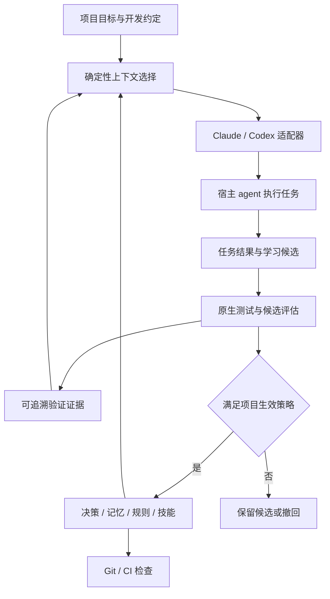

# keel 设计文档

> **keel = 龙骨**。给 vibe coding 装一根龙骨：船身再怎么被浪推，龙骨在，方向就不会散。
> keel 把项目目标、开发约定、任务经验和验证证据保存在仓库中，为不同 coding agent
> 提供一致、相关、可追溯的工作上下文，并通过可验证、可撤回的规则与技能更新，
> 减少重复犯错和重复探索。

- 仓库：`~/github/keel`（`github.com/shiftu/keel`，与 aivet 同一命名空间）
- 二进制：`keel`，Go 单文件；**keel 二进制本身**无运行时依赖。规则 `check` 调用的语言工具是外部依赖，不在「无运行时依赖」承诺内
- 仓库内数据：`<repo>/.keel/`（进 git）；本机缓存：`<repo>/.keel/cache/`（gitignore）
- 参考：[Tencent/teamai-cli](https://github.com/Tencent/teamai-cli)；keel 是它的「单仓库、零服务」子集，加上决策可追溯、证据关联和可验证的行为改进，见 §9
- 状态：设计稿 v2，2026-09-10；已吸收 [architecture-review.md](./architecture-review.md)。未实现

精确字段、状态机、命令参数与产物见 [formats.md](./formats.md)。本文讲为什么和边界；formats 是实现对照表。

## 1. 三句话理念

1. **仓库即大脑。** 所有长期状态都是 git 里的 Markdown + YAML。没有服务、没有账号、没有数据库。clone 下来就有，`git log` 就是审计。核心命令离线运行；只有显式的 `init --from` / 模板更新 / self-update 才访问网络。
2. **CLI 是笨的，agent 是聪明的。** keel 只做确定性的事：解析、查询、差异计算、命令执行、结果验证、产物渲染。自然语言判断、解释反例、整理经验和编写技能，交给 Claude Code / Codex。keel 内部**永远不调 LLM**。计数是确定性的，不因此变成客观结论。
3. **进化必须可验证、可撤回。** 任务经验 → 学习候选 → 对照验证 → 按既有策略生效 → 回归时撤回。扩大自决范围是有证据之后的结果，不是记录条数的副作用。

这和 ClipWarp 的「确定性内核 + AI 智能表面」是同一种分法：断网、换模型、换工具，龙骨照样在。

统一底座共享四种语义：**项目意图、上下文材料、验证证据、工作流策略**。工具目录是对这些语义的投影；各工具的 hook、权限和发现规则保留原生差异。

## 2. 架构

```
                       .keel/                 唯一事实来源，进 git
                       ├── intent.md          项目目标、非目标、约束、完成标准
                       ├── keel.yaml          工具与工作流策略
                       ├── decisions/         选择及其理由，保留否决与替代历史
                       ├── memory/            有来源和适用条件的事实、经验、反例
                       ├── rules/             不变量；candidate / active / retired
                       ├── skills/            可复用流程；来源、版本与评估
                       ├── evidence/          跨会话保留的验证摘要
                       ├── knowledge/INDEX.md 派生索引
                       ├── generated.yaml     产物所有权与 adapter schema 版本
                       └── cache/             可删：运行缓存、原始日志、接续摘要
                                │
                                │  keel sync   先规划 diff/冲突，再写入；幂等
              ┌─────────────────┼─────────────────────┐
         CLAUDE.md          AGENTS.md              Git / CI
         .claude/…          .codex/…               pre-commit  → check --target index
         skills / MCP       skills / MCP           commit-msg  → check --target commit-msg
              │                  │                 CI          → check --target range
         Claude Code           Codex
         SessionStart → keel hook <adapter> session-start   只读上下文
         Stop         → keel hook <adapter> stop            有界纠正，不豁免提交
         skills: keel-decide · keel-learn · keel-review
```

三条边界：

- **`.keel/` 是源，工具目录是产物。** 产物也进 git，所以没装 keel 的同事、CI、以及 keel 不支持的工具照样能读到 CLAUDE.md / AGENTS.md。keel 只改自己拥有的标记块 / 字段；冲突报出来，不覆盖用户改过的托管内容。
- **git hooks 与 CI 是工具无关的兜底。** agent Stop 只提供有界纠正；真正要提交的内容由 index / commit-msg / CI 重新计算。本地 hook 可被跳过，也不会随普通文件自动装到每个 clone——需要合并门禁的项目复用现有 CI。
- **agent hook 只做两件事。** 开场给稳定协议和可查询入口；收场做有界门禁。不监听每一次工具调用，不做打分。宿主 hook 走 `keel hook`，不把业务 CLI 退出码直接映射成宿主生命周期。



## 3. 数据模型

全部是带 YAML frontmatter 的 Markdown，另加 `intent.md`、`keel.yaml`、`generated.yaml` 与 evidence 记录。精确字段见 [formats.md](./formats.md)。

**ID：从 v0.1 使用带类型前缀的随机唯一标识**（`D-<uuid>` / `R-<uuid>` / `M-<uuid>` / `E-<uuid>`）。时间和标题负责展示排序；短前缀仅作无歧义的人类输入。canonical ID **永不重编号**。trailer 使用完整标识。两个 worktree 同时写入靠独占创建 + 同目录临时文件 + 原子替换；多文件状态转换另加锁和恢复记录。不做 `keel decide --renumber`。

### 3.1 意图 `intent.md`

项目目标、非目标、约束、完成标准。优先引用已有 README / 产品要求 / 架构目标；keel 不猜测目标。无额外输入也能初始化，未明确部分标记为待补充，不阻塞一般开发。

### 3.2 决策 `decisions/D-<uuid>-sqlite-over-postgres.md`

选择及其理由。正文固定四段：**背景 / 决定 / 备选与理由 / 后果与验证方式**。

**什么算决策**（写进稳定协议，agent 据此判断）：加/换依赖、跨两个以上模块的结构选择、改公开接口或数据格式、改构建/部署方式。够不上的写笔记。明确复用已有先例时引用已有决策，不强迫每次新建 ADR。

状态：`proposed | accepted | proven | revisit | superseded | rejected`。

- `proposed` 只记录替代**意图**（`supersedes` 字段），**不**立刻把旧决策改成 superseded。
- 在新决策进入 `accepted` 时原子更新两端引用。
- `why --history` 保留 rejected / superseded，并明确标记。路径变化先重定位或标 stale；归档保留原因，不自动删除决策与反例。
- 派生规则有独立状态。依据失效不等于继续强制执行，也不等于自动取消约束；替代决策必须同时说明规则迁移。

**决策 ↔ 提交**用 git trailer：`Decision: D-<uuid>`。用 `git interpret-trailers --parse` 解析，避免正文里的相似字符串。`commit-msg` 校验 ID 存在且对象完整、处于可用状态。squash merge 的 CI 覆盖完整 PR 变更，不依赖中间提交 trailer 被保留。

`keel why --path internal/store/` = scope 命中 ∪ trailer 引用，含历史。git 仍是提交索引；`.keel/` 是对象源。

`confidence` 是作者判断，不能单独授予可信状态或自决能力。`by: human` 是声明，不是身份校验。

### 3.3 规则 `rules/R-<uuid>-domain-no-infra.md`

不变量。`status: candidate | active | retired`。

- 读取 / 检索不执行规则。
- 新增可执行规则默认为 `candidate`。执行策略来自已有项目授权。候选不得通过修改自己的验证器使自己生效。
- 带 `check` 且 `active` 的是硬规则，只在明确的 check 阶段执行。`sh -c` 不是沙箱：限定 cwd、超时、子进程清理；结果区分 `pass | fail | error | timeout | skipped`。
- 示例检查优先调用已有工具；若用 grep，必须区分「无匹配」和「执行错误」。目录不存在时不得把 `! grep` 当成通过。
- `from` 指向的决策失效时，规则不自动 retired，check 报依据失效；替代决策负责迁移说明。

### 3.4 记忆 `memory/M-<uuid>-sqlite-wal-on-nfs.md`

有来源和适用条件的事实、经验、反例。不是「一段话 + tag」。

状态：`candidate | verified | disputed | stale | archived`。

- 未验证记录可检索，标 candidate；不以命令式口吻注入为项目规则。
- `verified` 必须有相关 evidence；代码、工具或适用条件变化后允许转 stale。
- 矛盾记录标 `disputed`，召回时同时展示冲突和来源。不能按最后修改时间静默覆盖。
- 失效、否决与失败是长期记忆。归档降低召回优先级，不删除历史解释。
- 相同 tag 的三条不同事实不构成一个可泛化规律；同一错误的三次转述不是三份独立证据。

任务接续与长期记忆分开：同机 Claude/Codex 共享 worktree 对应的缓存接续摘要（当前目标、完成项、下一步、失败验证和引用）。跨 clone 只保证已提交的知识与证据。缓存被删除不会撤销已生效知识，也不会丢失其验证依据。

### 3.5 证据 `evidence/E-<uuid>.md`

值得跨会话保留的验证摘要。保留被验证版本、验证器版本、结果和可复现入口。不把每次工具调用或完整对话放进 git。

- hash 只能发现内容变化，不能证明执行者可信。agent 手填的 pass 是声明；可复现执行或项目既有审查才提供相应验证。无可信 CI 时展示 `local` / `self-reported`，不伪装成跨机器认证。
- content digest 用明确定义的输入集合计算，排除证据文件自身和 cache。dirty 工作树证据必须说明具体输入，不能仅凭 HEAD 绑定。

规则连续失败、被拦次数等历史若只存在 gitignore 的 cache 中，换机器后行为会分叉。跨 clone 需要的计数与有效性必须进 git（evidence / 对象状态），cache 只加速。

### 3.6 知识 `knowledge/INDEX.md`

不建知识库。`keel sync` 从 `keel.yaml: knowledge.docs` 收集现有文档，取标题和首段生成索引，再附上按主题分组的决策和规则清单。agent 需要细节时读原文。

检索入口统一为 `keel why --query` / `--path`，不另设 `keel find`。仓库级的量用确定性排序 + 子串/路径/ID 匹配；BM25 / 向量 / 知识图谱都不做（见 §10）。召回评估不足时再考虑本地全文排序。

### 3.7 技能 `skills/<name>/SKILL.md`

标准 SKILL.md。保留来源、版本与评估信息。keel 自带三个技能，`init` 时放入；用户技能也放这里，`sync` 按所有权清单分发。

| 技能 | 触发 | 做什么 |
|---|---|---|
| `keel-decide` | agent 意识到自己在做决策 | 先 `keel why`，按**项目策略上限 ∩ 动作/路径 ∩ 有效先例**决定问人还是记录，写决策，拿完整 ID trailer |
| `keel-learn` | 有价值的任务结果、踩坑之后 | 写记忆候选 + 相关验证摘要；已有同类则合并或标 disputed。没有值得学习的内容时允许零记录结束 |
| `keel-review` | 显式维护任务或有界收尾 | 读 `keel review`，生成有上限的 candidate；对照验证；按既有策略生效或撤回 |

自动编写技能本身不算完成一次进化。技能评估需要宿主执行任务，模型成本在 Claude/Codex 一侧；keel 只组织夹具、校验结果、归档证据。

## 4. 命令

面向用户的主命令仍是 8 个；另增内部 hook 编解码入口。诊断能力作为 `check` 的子模式，不为报告界面或调度另建系统。

```
keel init [--tools claude,codex] [--from <git-url>]   建 .keel/，探测工具，规划 hook 集成，然后 sync
keel sync [--codemap]                                 .keel/ → 工具原生文件；先规划再写入
keel decide "<标题>" --tag db --scope 'internal/store/**'
keel why [--path p] [--query q] [--history]
keel note "<一句话>" --tag db [--path f.go]
keel check [--target worktree|index|commit-msg|range] [--json]
keel brief [--task t] [--path p] [--budget N]
keel review [--json]

keel hook <adapter> <event>                           内部：读 stdin，调内核，编码宿主输出
```

约束：

- 每个命令只接受属于它的选项，多余参数报用法错误（退出码 2）。
- `--json` 给 agent 和脚本；默认输出给人看，中文。所有机器输出带 schema 版本；stdout 只放机器结果，诊断写 stderr。
- 业务 CLI 退出码：0 通过 / 1 检查失败 / 2 用法错误。**不**把这套码原样当成 Claude/Codex hook 协议。
- `decide` / `note` 正文契约：`--body -` 读 stdin，`--body <file>` 读文件；无 body 且无 `--edit` 时 decide 写四段空模板，note 用位置参数正文。

## 5. 工具适配

adapter 只负责能力探测、产物渲染和事件编解码。业务策略在 `policy` + `evidence` + `check`，不散落在两套 skill/hook 模板里。

每个 adapter 声明可验证能力：instruction、skill、MCP stdio/HTTP、启动上下文、Stop 继续、压缩恢复。分别报告 `supported | unsupported | unknown` 和就绪条件。没有可确认的原生信任状态时报告 unknown，不以「文件存在」认定已启用。

| 产物 | Claude Code | Codex | 说明 |
|---|---|---|---|
| 稳定协议 | `CLAUDE.md` 标记块 | `AGENTS.md` 标记块 | 只放入口、验证命令、工作流上限；动态状态走 brief |
| 技能 | `.claude/skills/<name>/` | `.agents/skills/<name>/` | 默认复制；`--link` 用符号链接。所有权见 `generated.yaml` |
| MCP | `.mcp.json` | `.codex/config.toml [mcp_servers.*]` | 源是 `keel.yaml: mcp`；密钥只写环境变量引用。Codex 用 `env_vars`，不用假设 `${VAR}` 展开 |
| Hooks | `.claude/settings.json` | `.codex/hooks.json` | 调用 `keel hook <adapter> <event>`，不是 `keel check --json` |
| 规则文件 | `.claude/rules/keel.md` | （合并进 AGENTS.md） | 仅 soft / 非执行内容 |
| 兜底 | `.git/hooks/pre-commit`、`commit-msg` | 同左 | 与工具无关；安装必须识别 hooksPath / worktree / 现有 hook 管理器 |

Codex 项目层受信任以后，非托管 hook 的具体定义仍需走原生信任流程。新建或修改 hook 会影响信任状态；「信任项目一次」不是安装完成条件。适配器必须报告未就绪，不能自动绕开原生信任。keel 的 workflow policy **不得**声称能授予宿主沙箱、网络或发布权限。

能力缺失时仍可使用稳定协议、skills、显式 CLI 与 Git/CI。降级须说明失去哪些自动触发能力。

## 6. 闭环：一次会话里 keel 出现的时刻

```
SessionStart ──▶ keel hook … session-start
     │            只读：稳定协议入口 + 无任务时的基础材料；不跑项目检查
     │
  agent 工作中 ──▶ keel why --path/--query
     │             keel brief --task/--path
     │             keel decide / keel note
     │
Stop ─────────▶ keel hook … stop
     │            明确任务基线与当前工作树；未知基线则标明范围不确定
     │            提供纠正建议，记录 unresolved
     │            不读取猜测的 commit message 草稿
     │            去重只抑制重复反馈，不能把 failed 改成 passed
     │
git commit ───▶ pre-commit: check --target index
                commit-msg: 真实 trailer + 语义变更覆盖
CI        ───▶ check --target range（显式 base/head）
```

内核返回 `status + findings + target + evidence`。普通 CLI、Git hook 与宿主 hook 分别解释。finding 使用稳定 code、对象/路径和可执行修正建议。

Stop 首次出现可修正问题时可请求一次继续；已有 `stop_hook_active` 或已反馈相同问题时结束循环，并保留未解决结果。不会产生成功证据，也不会令提交检查豁免。支持 turn id 时以 repo/worktree/session/turn/信号摘要去重；不能用 session id 永久放行后续任务。

用户明确中止或任务只要求分析时，不用「必须写代码/提交/产生笔记」强迫继续。

## 7. 防腐：验证绑在真正要提交的内容上

1. **规则可执行，但 candidate 不执行。** 硬规则在 index / range 检查中跑。规则从决策派生；决策被合法 supersede 时必须同时说明规则迁移。
2. **决策有管辖范围。** `scope` 命中用于上下文；**语义变化**（新依赖、契约/公开接口、构建部署方式）才要求解释。无关 ID 和空文件不算覆盖。
3. **依赖和结构变化必须留痕。** 对已支持 manifest 解析依赖集合、类型和来源的变化；区分格式调整、版本更新和新依赖。未知格式只报告待判断信号。`.keel/` 与生成工具目录不应因 init 本身触发「新架构目录」。
4. **三种检查目标分离。** worktree / index / commit-or-range。不能把工作树通过伪装成 index 通过。若 MVP 做不到可靠的暂存快照，对相关部分暂存情形报告无法完成提交验证，并给出解决步骤——不能偷偷 stash/reset 用户工作树。

决策引用至少满足：对象完整且处于可用状态、覆盖相关路径、并与本次依赖或契约变化建立解释关系。

## 8. 进化

### 8.1 统一生命周期

观察 → 候选知识 → 验证 → 生效 → 失效/撤回。

决策、规则、技能是不同用途的产物，**不要求**笔记必须逐级变成技能。一条可靠事实可以长期只是事实；一次架构选择不一定产生技能。

1. **记录结果。** 宿主在任务结束时整理值得保留的经验；keel 保存相关验证摘要。`keel-learn` 承担，不存完整会话。
2. **找候选。** `review` 按重复问题、相关失败、显式纠正、过期依赖给出候选与依据。次数只决定审阅优先级，不直接决定可信或生效。
3. **生成修订。** `keel-review` 为事实、规则或技能生成 candidate，附来源、适用条件、反例和预期收益。每个维护批次限制候选数。
4. **对照验证。** 硬规则测试一个应该通过、一个应该失败及一个边界用例；技能在固定任务和固定项目快照上比较旧版与候选。验证器由现行基线提供，不能同一候选自行放宽后宣告通过。
5. **按已有策略生效。** 在预授权范围内，补充来源、去重和通过验证的事实可自动维护。新硬规则、改变项目约束或扩大工作流上限的修订走项目既有审查路径；不要求每条普通笔记都询问用户。
6. **回看与撤回。** 记录生效版本、证据和被替代版本。发现反例或回归就标 disputed/retired，恢复相应旧规则或技能；不撤销不相关的业务代码，不删除失败历史。

执行时机：learn 跟随有价值的任务结果；review 在显式维护任务或有界收尾中运行。没有活动中的宿主 agent 时不自行调用模型。

### 8.2 工作流自主度

MVP 保留 0/1/2 作为**工作流建议**，上限由项目既定策略给出。显式用户授权持续有效，不因一条笔记或低级别提示重复请求。

```
项目内可自决范围 = 已有授权与项目策略上限
                 ∩ 当前动作和路径范围
                 ∩ 有效先例及验证条件

有效执行还必须满足宿主和组织的原生权限要求。
```

- tag 只服务检索，不单独决定风险。三个 SQLite 使用先例不能覆盖同为 `db` 的生产迁移或数据删除。
- 多项策略同时命中取约束更严格者；低风险标签不能抵消路径或动作上的限制。解析不了风险时不推导自动升级。
- **MVP 停用按 proven 计数自动升级**，只输出建议。新增 proven 只影响建议和先例可用性。
- 级别 1 只允许复用适用范围内、没有失效证据的先例。
- 修改这套策略走原有配置审查，不由正在争取升级的候选自我批准。
- agent 把决策改成 proven 不算独立验证；没有相关 evidence 时自决上限不变。

## 9. 与 teamai-cli 的取舍

| teamai-cli | keel | 为什么 |
|---|---|---|
| 独立 team repo + OAuth + 成员注册 | 项目仓库自己就是源 | 单仓库场景不需要第二个仓库和账号 |
| push → MR → pull 分发 | `git commit` 就是分发 | `.keel/` 和产物都进 git |
| BM25 + 图检索、tree-sitter 代码图谱 | `why --query/--path`；`--codemap` 只列目录 | 仓库级的量先用确定性匹配 |
| Stop hook 打摩擦分、周报、Dashboard | Stop 只做有界门禁；`review` 一页报告 | 不做观测产品 |
| roles / tags / source 订阅 | `init --from <git-url>` 复制固定版本模板 | 跨仓库共享 = 复制一份 `.keel/`（M4） |
| 团队能力分发与改进流程 | 单仓库内决策可追溯、证据关联、可验证的行为改进 | 不复制它的团队服务 |

## 10. 明确不做（YAGNI）

- keel 内部不调 LLM，不管 key，不管网关（那是 aivet 的事）。
- 不做服务端、账号、Dashboard、周报。
- 不做 embedding、向量库、AST、代码图谱。
- 不做插件市场、包安装；MCP 只写配置不装二进制。
- 不监听 PreToolUse / PostToolUse；不给会话打分。
- 不做「团队角色」；需要分发差异就开两个模板仓库。
- 不把记录条数或 token 降低当成「更聪明」的验收。

## 11. 技术栈与布局

Go 1.27，单二进制，结构对齐 aivet：

```
cmd/keel/                 main
internal/cli/             子命令、参数校验、业务退出码
internal/store/           读写 .keel/（frontmatter、稳定 ID、独占创建、原子替换）
internal/policy/          工作流上限、动作/路径约束、先例适用性
internal/evidence/        摘要、digest、状态推导（candidate/verified/disputed）
internal/render/          .keel/ → 产物；所有权清单；标记块与 JSON/TOML 合并
internal/adapter/claude/  能力探测、settings.json、.mcp.json、hook 编解码
internal/adapter/codex/   能力探测、config.toml、hooks.json、hook 编解码
internal/gitx/            trailer、结构化 diff、hook 安装（hooksPath/worktree/管理器）
internal/check/           按 target 验证、规则执行器、finding 编码
internal/brief/           按任务/路径选择上下文，字节预算
internal/review/          候选与依据；次数只排优先级
internal/ui/              中文输出、--json（schema 版本）
templates/                go:embed：三个内置 skill、hook 脚本、CLAUDE.md 块
```

依赖：`yaml.v3`、`go-toml/v2`、`doublestar`。不用 cobra。测试用 `testscript` 跑端到端；P1 壳缺陷与 hook 夹具放 `docs/design/fixtures/`，实现后迁到 Go 测试。

## 12. 里程碑

| 阶段 | 交付 | 验收重点 |
|---|---|---|
| **M0 · 协议定稿** | 稳定 ID、状态机、检查目标、hook 结果、生成所有权、最小证据 schema | 审查 P1 都有一致契约与对应夹具 |
| **M1 · 统一底座** | init/sync/decide/why/check，加最小 brief/note、两套适配、Git/CI 接入 | Claude 写出的经验由 Codex 正确召回；提交坏代码会失败；重复 sync 无差异 |
| **M2 · 可信记忆** | 任务接续、证据记录、冲突/过期/归档、任务相关检索 | 换工具继续同一任务；旧结论失效后不被当成现行规则；clone 保留验证依据 |
| **M3 · 受控进化** | review 候选、技能/规则版本、任务对照评估、生效与撤回 | 学习后正确完成复发任务；无关任务不被新规则误伤；失败候选不生效 |
| **M4 · 复用与扩展** | 固定来源版本的模板导入、更新差异与更多适配器 | 模板更新不覆盖本地演化；未支持能力被准确报告 |

brief/note 前置到 M1，因为记忆的写入与召回属于产品核心。自动扩大自决范围后置到 M3 且仍受项目策略上限约束。

### M1 切片（防止规格膨胀吃掉第一版）· 已实现

v2 规格是目标形态，不是 M1 的实现清单。M1 只做下表左列；右列的字段可以出现在 frontmatter 里但内核不解释。

| M1 实现 | M1 只保留字段、不实现行为 |
|---|---|
| `intent.md` 骨架（全「待补充」+ README 链接） | — |
| 决策：全部状态、`proposed→accepted` 原子替代、trailer 校验 | `evidence`、`confidence` 参与任何计算 |
| 规则：`active` + `check.argv` 执行、`rule_basis_invalid` | `candidate` 的对照验证、`verifier_digest` |
| 记忆：`candidate` 写入与召回 | `verified / disputed / stale` 的推导；`evidence/` 目录整个后置到 M2 |
| `check --target worktree\|index\|commit-msg`；index 用 `git checkout-index --temp` 到临时目录 | `range`（CI）后置到 M2 |
| 语义信号：仅 `go.mod` / `package.json` 依赖集合 + 顶层目录 | 其余 manifest 只报「未知格式」 |
| `brief`：`--path` / `--task` 子串匹配 + 字节预算 | `why_selected` 的多级排序，先按状态、路径命中、时间三级 |
| `policy`：`min(default, actions, paths)` | 先例适用性与 evidence 求交 |
| adapter：能力 = 二进制存在 + 文件已写；Codex 信任只提示 | supported/unsupported/unknown 细分探测 |
| `generated.yaml` + 冲突检测 | — |
| `keel hook` session-start / stop（exit 0 + JSON） | 去重只按 session + 信号摘要，turn id 后置 |

原则：M1 结束时，v1 的三个承诺必须成立——决策进仓库、坏提交被挡、Claude 写的经验 Codex 能召回。其余都是 M2+ 的证据与进化层。

**实现状态（2026-09-10）：** M0 与 M1 已实现并有测试。与上表的两处偏差：

- `check --target range` 一并实现了（原计划 M2）。它与 index 共用同一套信号机制，
  多写十行就能让 CI 用上；不做的话 `keel check --target range` 在 CI 里只会报错。
- `knowledge/INDEX.md` 与 `evidence/` 的产出没做，`keel review` 仍是 M3。
  `evidence/` 目录会被 `init` 建出来，但 M1 不产生任何证据记录；
  因此 `policy.Precedents` 的 `Verified` 恒为 false，手写 proven 不会提高自决上限——
  这正是审查 P1-04 要的行为。

**M2 实现状态（2026-09-10）：** 上表全部实现并有测试。`Precedents.Verified` 现在接的是真实证据，
但它**只出现在 brief 的说明里**，不参与上限计算——扩大自决范围仍然只能改配置，
和 M1 时一样。审查 P1-04 的行为没有因为证据模型上线而松动。

### M2 切片 · 已实现

M2 = 可信记忆。四件事：证据真的被跑出来、记忆有可推导的生死、任务能跨工具接上、检索按任务收敛。

| M2 实现 | M2 不做 |
|---|---|
| `keel verify`：跑验证器 → 写 `evidence/E-*.md` → 按状态表转换 subject | 「登记一条我认为它通过了」的自述入口 |
| 记忆生命周期推导：`memory_status_unsupported` / `_evidence_stale` / `_review_due` / `_conflict` | `check` 自动改写文件里的 `status` |
| 双 digest：`subject_digest`（结论变没变）+ `target.content_digest`（代码变没变） | 增量摘要与缓存复用 |
| `keel task set/show/clear`：worktree 级接续摘要，进 brief 与 SessionStart | 跨 clone 接续、跨机器同步 |
| brief 六档确定性排序 + 先例证据提示 | BM25 / 向量 / 相似度 |
| `knowledge/INDEX.md` 由 sync 生成并进 git | `--codemap`（M4） |
| `policy.Precedents.Verified` 接上真实证据 | 因此自动扩大自决上限（永不） |

两条不退让的边界：

1. **证据只能由 keel 真的跑完一次验证器产生。** 没有自述入口。自我确认写进仓库就撤不回来了。
2. **`check` 只推导不改写。** 状态转换的入口只有 `verify` 和人手工编辑，两者都留在 git diff 里。

`memory_status_unsupported` 定成 error 而不是 warn：文件自称 verified 但证据支持不了，
等于把未验证的经验当项目规则用——这正是审查 P1「记忆缺少可信生命周期」要挡的。

### M3 切片 · 已实现

M3 = 受控进化。规则从候选走到生效，要过得了对照验证；生效之后出问题，要撤得回来。

| M3 实现 | M3 不做 |
|---|---|
| `keel review`：到期、失效冲突、确定性学习候选簇、统计。**只读，不执行任何规则** | 自动写出修订文本（那是宿主 agent 的活） |
| 规则 `cases`：夹具是 `.keel/cases/` 下的真目录，pass / fail 两个方向必须都有 | 通用 fixture 框架、容器化、快照隔离 |
| `keel promote R-…`：跑对照验证 → 写证据 → candidate 转 active | 自动 promote；没有有效决策依据的规则不能 promote |
| `keel retire R-… --reason`：转 retired，正文留原因，提示被它替代过的旧规则 | 自动撤回；删除失败历史 |
| 规则按 scope 与本次变更集求交后才执行；Stop 与 review 不执行规则 | 跨 target 的规则结果缓存 |
| 技能版本与对照评估 | **后置到 M4**，理由见下 |

三条不退让的边界：

1. **规则执行只发生在人显式发起的验证里**（worktree / index / range），且只跑与本次变更相关的那些。
   `review`、`brief`、SessionStart、**Stop** 都不执行——审查里说得很清楚：
   来自模板或自动提炼的内容不该因为「看一眼报告」就变成代码执行。
2. **promote 不能自我批准。** `cases` 必须 pass / fail 双向齐全且全部符合预期，
   且规则必须有一条有效决策做依据。只证明「该过的过了」不算对照验证——
   一条永远 `exit 0` 的检查也能满足。
3. **撤回保留历史。** retired 的规则、失败的 promote 证据都留在仓库里。

**M3 实现状态（2026-09-10）：** 上表全部实现并有测试。一处顺带修正：
M1 时 Stop hook 会执行规则，与「自动触发的入口不执行仓库代码」冲突，M3 把它改成只做对象层检查。

**技能版本为什么后置：** 技能评估要求宿主在固定任务集和固定项目快照上执行任务，
再比较旧版与候选。模型成本在 Claude/Codex 一侧，keel 只能组织夹具、校验结果、归档证据。
在那套任务集存在之前做「技能版本号 + 状态字段」，只会给出一个没有验证支撑的可信度——
正是 M2 拒绝掉的那种自述。规则的对照验证能真跑，所以 M3 先做规则。

### M4 切片

M4 = 复用与扩展。一句话：**模板给的是建议，不是既成事实。**

跨仓库共享 = 复制一份 `.keel/` 的可复用部分，并把来源钉死在一个 commit 上。
钉住之后才谈得上「更新差异」——没有基线就只有覆盖，没有 diff。

| M4 实现 | M4 不做 |
|---|---|
| `keel init --from <url>[@<ref>]`：把模板仓库的 `.keel/` 可复用部分导入，来源解析成 commit 写进 `template.yaml` | 导入 `decisions/` `memory/` `evidence/` `intent.md` |
| 导入面：`keel.yaml`（`tools` 除外）、`skills/**`、`rules/*.md`、`cases/**` | 覆盖任何本地已存在的文件——`init` 的语义不变 |
| 规则一律落成 `candidate`，填 `from_template`，`evidence` 清空 | 让模板决定哪条规则是 `active` |
| `keel template status`：来源、钉住的 commit、本地哪些文件相对导入基线动过 | 隐式联网；只有 `init --from` 与 `template update` 访问网络 |
| `keel template update [--to <ref>] [--dry-run]`：三方比较后只快进安全的那些 | 三方冲突时自动合并或择一覆盖 |
| `--codemap`：`git ls-files` 出来的目录概览，写 `knowledge/CODEMAP.md` | AST、符号表、调用图 |
| 技能的「版本」= `template.yaml` 钉住的 commit | 技能对照评估（仍缺宿主任务集，见下） |

#### 三方比较

每个导入面里的文件都有三个状态：`base`（`template.yaml` 记的导入时摘要）、
`theirs`（模板新版）、`ours`（本地现在）。动作只由这三个决定：

| ours vs base | theirs vs base | 动作 |
|---|---|---|
| 同 | 同 | 无变化 |
| 同 | 变 | **快进**：写入 theirs，基线推进 |
| 变 | 同 | **保留本地**：本地演化，模板没动，基线不变 |
| 变 | 变 | **冲突**：不写，报出来，基线不变 |
| 本地已删 | 任意 | 报告，不写回。删除是本地的选择 |
| 任意 | 模板已删 | 报告，**不删本地** |
| 本地没有 | 新增 | 写入。没有本地内容会被盖掉 |

`keel.yaml` 比较前先把 `tools` 清空再算摘要：`tools` 是本机探测结果，
它跟模板不一样是正常的，不该让整个配置文件永远停在「本地已改」而收不到模板的策略更新。
快进写入时保留本地 `tools`。

冲突不阻塞其他文件：能快进的照常快进，冲突的原样留着并在退出码里体现。
这一条对应验收「模板更新不覆盖本地演化」——**任何一种「两边都变了」都不写**。

#### 为什么规则只能是 candidate

M3 定了 `promote` 不能自我批准：规则要过 `cases` 双向对照验证，且必须有一条有效的本地决策做依据。
模板导入不能绕开这条，否则「装个模板」就等于「让别人的仓库决定我这边执行什么代码」。

所以导入的规则：`status` 强制 `candidate`（模板里写的是什么都一样），`evidence` 与
`verifier_digest` 清空（那些是对着源仓库的代码算的，在这边永远对不上），`from` 也清空。

`from` 清空这一条是实现时改的。原本按 §4 的「指向未映射项目决策的 `from` 不能使规则生效」
留着悬空引用，结果 `keel check` 报 `ref_missing`（error）——刚导完模板就满仓库红字，
pre-commit 直接过不去。本地没有依据就是没有依据：`promote` 会因此拒绝，这才是实情，
不需要再靠一个悬空 ID 来表达。出处也没丢：`from_template` 记 `<source>@<commit>`，
commit 是钉死的，去源仓库那一版上就能看到那条规则原本的 `from` 指向谁。

要让它生效，本地得走完整条路：`keel decide` 记下自己的理由 → 改 `from` → `keel promote` 跑对照验证。

**M4 实现状态（2026-09-10）：** 上表全部实现并有测试（`template-import` / `template-update` / `sync-codemap`）。
两处与写这份切片时的设想不同，都是实现时被自己的检查拦下来才发现的：

- **导入的规则 `from` 清空**，而不是按 §4 原样保留一个指向未映射决策的引用。留着会让
  `keel check` 报 `ref_missing`（error）——刚导完模板就满仓库红字，pre-commit 直接过不去。
- **`keel.yaml` 的三方比较按含义而不是字节。** 只清 `tools` 不够：`init` 写本地配置时是把结构体
  序列化出去的，字段顺序和空值写法跟模板手写的那份对不上，第一次 `update` 就把「什么都没改」
  报成了冲突。改成两边都解码再用同一个编码器写回。

「更多适配器」这一格没做：claude / codex 之外没有加新的。M4 的验收点「未支持能力被准确报告」
由现有两家的 `unknown` 分级承担（Codex 的项目层信任流程仍报 unknown，没有因为文件写出去就宣称已启用）。

#### 技能对照评估继续后置

M3 说技能版本后置到 M4，理由是评估要求宿主在固定任务集上跑。那套任务集现在仍然不存在，
所以 M4 只做**版本**不做**评估**：技能的版本就是 `template.yaml` 钉住的那个 commit，
可追溯、可 diff、可回退到明确的旧版本。凭空加一个 `skill_version` 字段再配一个没有验证支撑的可信度，
仍然是 M2 拒绝掉的那种自述。

首批验收场景（实现时必须可观察）：

| 场景 | 必须观察到的结果 |
|---|---|
| 只有三个手写 proven、没有验证证据 | 自决上限不变，指出缺失依据 |
| `db` 成功先例 + 高风险数据操作 | 不因同 tag 自动复用授权 |
| 新增依赖 + 无关/空 ADR | 提交验证失败，说明具体未覆盖信号 |
| 更新 manifest 格式或普通脚本 | 不误报为新增依赖 |
| 不受信任的 Codex hook | 诊断明确显示未启用，显式 CLI 仍可用 |
| Stop 反复出现同一个未解决问题 | 结束重复反馈，保留失败状态；提交依旧检查 |
| 暂存坏代码、工作树有未暂存修复 | 不以工作树结果证明 index 通过 |
| proposed 决策声明替代 accepted 决策 | 旧决策继续生效，直到合法状态转换 |
| 两个 worktree 同时记忆和决策 | 无 ID 混淆或覆盖，历史 trailer 仍可解析 |
| 用户改过生成技能；源技能随后被删除 | sync 报冲突，不覆盖或删掉用户修改 |
| 切换分支、修改规则后立即 brief | 旧验证不显示为当前通过 |
| 错误笔记被重复引用三次 | 不算三份独立证据，不自动升级成规则 |
| 已否决方案在新任务中再次被考虑 | why 能找回否决原因和适用条件 |
| 技能升级带来新的失败或误报 | 候选不生效，或可撤回到明确旧版本 |

效果评估同时记录：任务正确完成、应召回知识命中、无关/过期记忆注入、重复错误、人工纠正和验证成本。不以 Dashboard 或记录条数代替任务质量。

## 13. 已关闭的待定项

- 产物是否进 git：**进**。可在 `keel.yaml: sync.commit_outputs: false` 关掉。
- `Decision:` trailer 是否强制：默认**不强制**存在 trailer；有语义变化时要求覆盖关系。`gate.require_trailer: true` 可改成硬性。
- 决策 ID 并发：稳定唯一 ID，不重编号。
- Codex Stop 能否 block：adapter 按探测到的能力编码；不能 block 时降级说明，提交检查仍在 Git/CI。
- 绝对无网络：改为「核心离线；显式安装/更新才访问网络」。
- `keel find`：并入 `why --query`。
- `--renumber`：删除。
